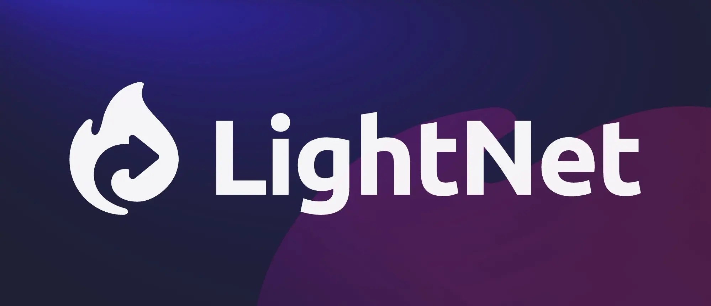

Share the gospel and strengthen believers in your community.

LightNet makes it easy to run your own digital media library, so more people can find what they need and grow in faith.

Built as an integration for the [Astro framework](https://astro.build), LightNet enables the creation of fast, statically generated websites that can be easily hosted on any file server. These sites are optimized for performance, easily extendable, and fully support internationalization.

Learn more on the [LightNet homepage](https://lightnet.community).

## Start Your Own Library

Get up and running quickly with LightNet by exploring its features and best practices. You can build your own media library by starting with the [LightNet example template](https://github.com/LightNetDev/example-template), which creates a local copy of a demo site for a fictional skateboard ministry. This beginner-friendly template serves as a great starting point for developers.

To get started, simply run the following command in your terminal:

```bash
npm create astro@latest -- --template LightNetDev/example-template
```

This will set up a demo site that you can customize and expand to meet your community’s needs.

## Documentation

Need help? [Explore the LightNet developer docs](https://docs.lightnet.community) for everything you need to get started and make the most of LightNet.

## Showcase

Want to see LightNet in action? [Visit the MediaWorks digital library](https://library.mediaworks.global) and see how it powers a real-world digital library.

## Contributing

Want to help improve LightNet? [Check out the contribution guide](https://github.com/LightNetDev/lightnet/blob/main/CONTRIBUTING.md) to learn how you can get involved and make a difference!

## License

LightNet is licensed under the MIT License. See the full details in the [LICENSE](https://github.com/LightNetDev/lightnet/blob/main/LICENSE) file.
